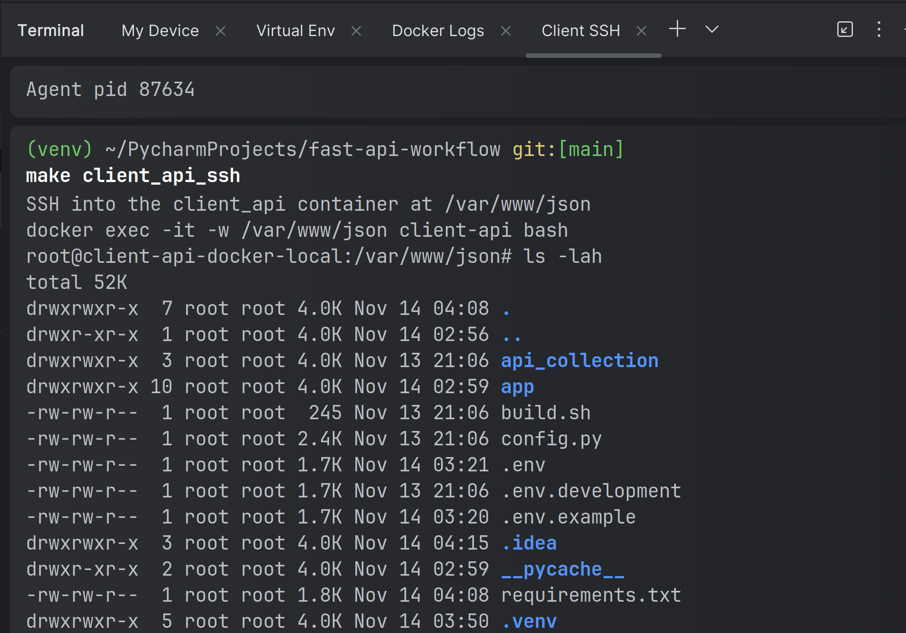

# Fast API Framework Workflow #

Me using various tutorials to figure out a modern and up-to-date
set of strategies, tips and best practices to use with
Fast API.

## Tools used
1. Docker & Docker Compose
2. Pydantic
3. Dynaconf for configs
4. Makefile for commands


## Folder Structure


## Resources
1. NoSQL DB - Redis
2. Cache - Redis
3. DB 1 - MySQL
4. DB 2 - Postgres


## Setup and Installation (Ubuntu 22)
- Prerequisites & Preferences
  - Ubuntu 22 host machine - preferred
  - PyCharm
- Open the dockerfile at `services/client_api/python3_12.dockerfile` and apply the following code from there to your
  host machine. The app is dockerized but this will make make coding in an IDE on your host machine while the app is on 
  a guest in docker, easier. These instructions assume py 3.12 if you want to get flexible.
    ````
    sudo apt-get update

    sudo apt-get install -y --allow-downgrades --allow-remove-essential --allow-change-held-packages \
       bash                         \
       build-essential              \
       curl                         \
       gcc                          \
       git                          \
       htop                         \
       llvm                         \
       pkg-config                   \
       software-properties-common   \
       supervisor                   \
       tk-dev                       \
       unzip                        \
       vim                          \
       wget                         \
       xz-utils                     \
       zip

    sudo apt-get update       
       
    sudo apt-get install -y --allow-downgrades --allow-remove-essential --allow-change-held-packages \
       libcairo2-dev                \
       libdb5.3-dev                 \
       libexpat1-dev                \
       libffi-dev                   \
       libgdbm-dev                  \
       libgif-dev                   \
       libgirepository1.0-dev       \
       libjpeg-dev                  \
       liblzma-dev                  \
       default-libmysqlclient-dev   \
       libmysqlclient-dev           \
       libncurses5-dev              \
       libncursesw5-dev             \
       libpango1.0-dev              \
       libpcap-dev                  \
       libpq-dev                    \
       libreadline-dev              \
       librsvg2-dev                 \
       libsqlite3-dev               \
       libssl-dev                   \
       libbz2-dev                   \
       zlib1g-dev

    sudo add-apt-repository ppa:deadsnakes/ppa

    sudo apt-get update

    sudo apt-get install -y --allow-downgrades --allow-remove-essential --allow-change-held-packages \
       python3.12            \
       python3.12-dev        \
       python3.12-venv       \
       python3-pip           \
       python3.12-distutils  \
       python3-openssl
       
    sudo update-alternatives --install /usr/bin/python3 python3 /usr/bin/python3.12 312
    sudo update-alternatives --set python3 /usr/bin/python3.12
    ````
- Open a terminal on your host machine and run `python3 --version`. You should see something similar to `Python 3.12.7`
- Open up PyCharm and add a new "Project from Version Control"
  - Get authorization or access to the repo
  - Add it as a new project to your preferred directory. For example, you can store this project 'fast-api-workflow' to
    the default 'Pycharm Projects' directory like so: `~/PycharmProjects/fast-api-workflow`.
  - We will refer to 'fast-api-workflow' as the "project directory"
- Navigate to your project directory:
   - `cd ~/PycharmProjects/fast-api-workflow` or
   - Open the terminal in Pycharm while in the fast-api-project you just created
- and create a virtual env by running `python3 -m venv .venv`
  - Immediately add the .venv folder to the .gitignore file. It should NOT be committed to the repo
- In Pycharm, usually at the bottom left toolbar, you should change the interpreter to the Python 3.12 interpreter in 
  your .venv folder.
- Now, in Pycharm, if you open a new terminal, you should be automatically in your virtual env when it opens:
  - Instead of this in your terminal: `~/PycharmProjects/fast-api-workflow`
  - You should now see this: `(venv) ~/PycharmProjects/fast-api-workflow`
- The first terminal, the one that is not in your virtual environment, rename from "Local" to "My Device"
- The second terminal, the one that is in your virtual environment, rename to "Virtual Env"
- Should look like this:
- Go to the My Device terminal and run these commands:
  ````
  python3 -m ensurepip --upgrade  \
    && pip3 install --upgrade pip  \
    && python3 -m pip install --upgrade setuptools  \
    && pip3 install --upgrade setuptools
  ````
- In your project directory, copy `.env.docker-compose.example` to `.env.docker-compose`
  - Update the values in the newly created `.env.docker-compose` file to relevant values
  - Make sure you use ports that are open and not in use
  - Add `.env.docker-compose` to the .gitignore file
  - You can find out what your username is by entering `whoami` in the terminal on your device
  - You can find out your group by enterng `groups` in the terminal on your device
  - You can find out your gid & uid for your user and groups by entering `id <your username>` eg: `id johndoe`
- Next, from your project directory, go to the `volumes/repos/client_api` repo. We will call that the `Dev Code` folder
  - This is the actual code project, everything above and outside it relates to the environment this dev code will run in
  - Copy `volumes/repos/client_api/.env.example` to `volumes/repos/client_api/.env`
  - Change `APP_ENV` from `production` to `development`
- In the My Device terminal, at the project directory, run: `make boot` and let that run for a while. You can also run
  `make boot_clean`: This will clean out all other docker images and containers on your device before running the same 
   commands as `make boot`
  - While `make boot` is running, let's do some clean up:
    - Still in Pycharm, open up the main menu and Rename this project to: "Environment: Fast-API-Workflow"
    - Note the folder: `volumes/repos/client_api`
    - Make this dev code folder it's own project. Open up the main menu, select New Project and do something similar to this:
      - 
      - Make sure to leave the name at the top empty or your code will get dumped into a sub directory
      - Ok the create from existing files pop-up
      - Rename this new dev code project to "Dev Code: Fast-API-Workflow"
    - Open up your fav HTTP Client and try to hit the `root` and the `health-status` endpoints
- `make boot` should be done by now
  - You should see something like this: 
- We need to go into the Dev Code project and clean up any unistalled packages. Keep in mind that this will happen on the 
  host machine. We will do something else later on to ensure the docker container gets the correct list of packages. 
  Is this ideal? NO! When national grid dey perfect, you can make a PR on your own time and make an improvement - (Poetry, maybe?)
- Go through all the main files of the app. Once Pycharm has stopped prompting you to install this or that package, then
  you will have a good and proper `requirements.txt` file
- Now that we have our package list up to date,we are going to access the docker container directly by opening another terminal.
  - Deactivate the virtual environment by typing `deactivate` in this new terminal
  - From your device and your project folder run: `make client_api_ssh`. This will take us into the 
    container at the folder `/var/www/json`
  - Your terminal should look like this: 
- On the "Client container", we are going to resolve any package issues that may exist on the container. To get started, run the following code:
  ````
  python3 -m ensurepip --upgrade      \
  && pip3 install --upgrade pip      \
  && python3 -m pip install --upgrade setuptools      \
  && pip3 install --upgrade setuptools     \ 
  && pip3 install -r requirements.tx
  ````
- After running that once, follow any propmts and resolve any dependency issues in the requirements file and then re-running the last line: `pip3 install -r requirements.txt`
- Do this as many times as needed until you see no more errors to resolve. At this point, go back to your  http client and hit the root and health status endpoints:
- 